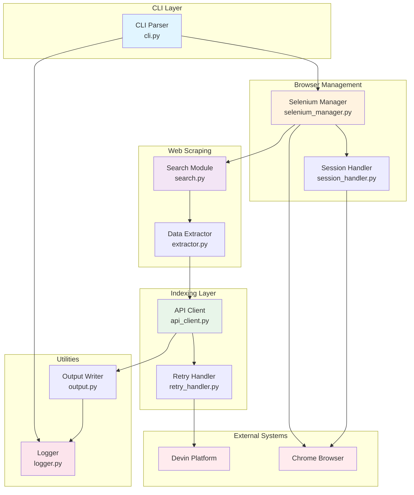
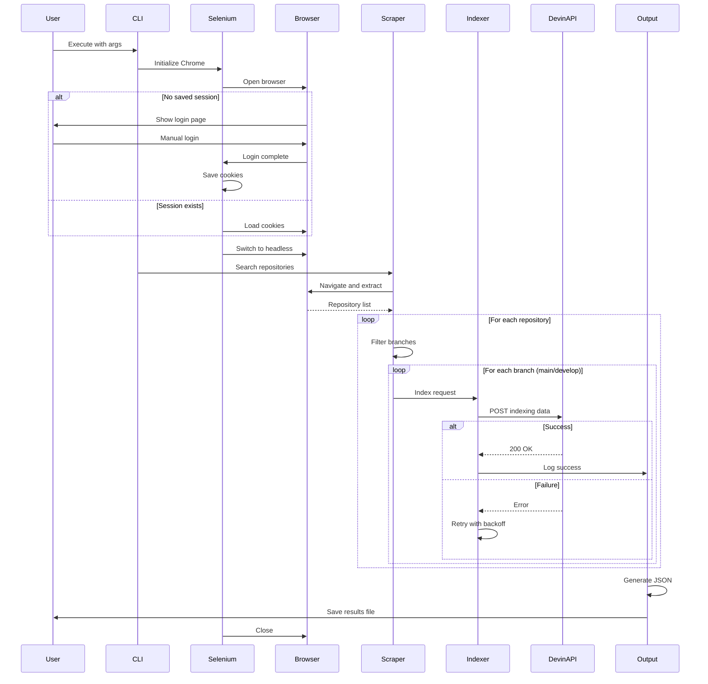
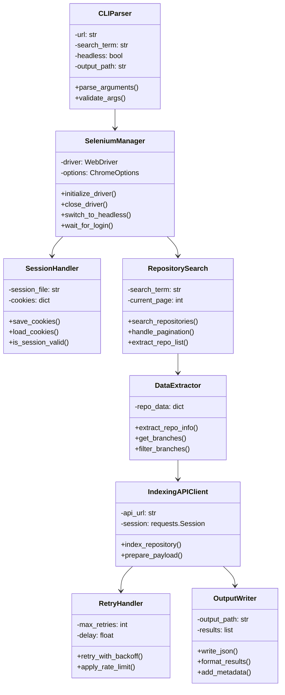
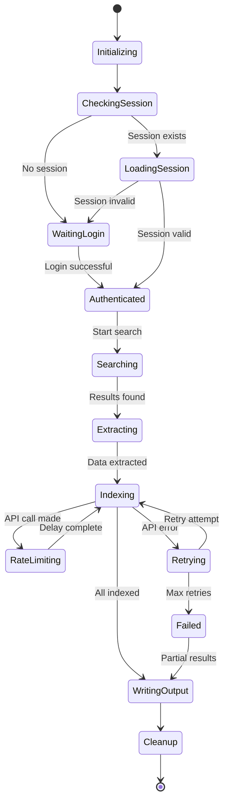

# Arquitetura da Aplicação - Devin Repository Indexer

## Diagrama de Componentes



## Fluxo de Dados



## Estrutura de Classes



## Padrões de Design Utilizados

### 1. Singleton Pattern
- **SeleniumManager**: Garante uma única instância do WebDriver
- **Logger**: Instância única de logging para toda aplicação

### 2. Strategy Pattern
- **RetryHandler**: Diferentes estratégias de retry (exponential, linear, fixed)
- **DataExtractor**: Diferentes estratégias de extração baseadas na estrutura da página

### 3. Factory Pattern
- **WebDriver Factory**: Criação de diferentes tipos de drivers (Chrome, Firefox)
- **Output Factory**: Criação de diferentes formatos de saída (JSON, CSV)

### 4. Observer Pattern
- **Progress Tracker**: Notifica sobre progresso da indexação
- **Logger**: Observa eventos e registra logs

### 5. Command Pattern
- **CLI Commands**: Encapsula operações como comandos executáveis
- **API Operations**: Cada operação de API como comando independente

## Gerenciamento de Estado



## Tratamento de Concorrência

### Estratégia de Threading
- **Main Thread**: Gerenciamento do Selenium e navegação
- **Worker Threads**: Chamadas paralelas à API (com rate limiting)
- **Logger Thread**: Processamento assíncrono de logs

### Sincronização
- **Locks**: Proteção de recursos compartilhados (cookies, session)
- **Queues**: Fila de repositórios para indexação
- **Semaphores**: Controle de rate limiting

## Segurança e Privacidade

### Dados Sensíveis
1. **Cookies de Sessão**
   - Armazenados em arquivo criptografado
   - Permissões restritas (600)
   - Não versionados no Git

2. **Logs**
   - Sanitização de dados sensíveis
   - Rotação automática
   - Retenção limitada

3. **API Keys**
   - Variáveis de ambiente
   - Nunca em código-fonte
   - Validação antes do uso

### Comunicação
- HTTPS obrigatório
- Validação de certificados SSL
- Timeout em requisições

## Performance e Otimização

### Caching
- Cache de resultados de busca
- Cache de estrutura de páginas
- TTL configurável

### Batch Processing
- Agrupamento de requisições
- Processamento em lote
- Redução de overhead

### Resource Management
- Pool de conexões HTTP
- Reuso de sessões
- Cleanup automático de recursos

## Monitoramento e Observabilidade

### Métricas Coletadas
- Tempo de execução total
- Tempo médio por indexação
- Taxa de sucesso/falha
- Número de retries
- Rate limit hits

### Logs Estruturados
```json
{
  "timestamp": "2026-04-30T01:30:00Z",
  "level": "INFO",
  "component": "IndexingAPIClient",
  "action": "index_repository",
  "repository": "org/repo",
  "branch": "main",
  "duration_ms": 1250,
  "status": "success"
}
```

### Health Checks
- Validação de sessão ativa
- Conectividade com API
- Disponibilidade do WebDriver
- Espaço em disco para logs

## Escalabilidade

### Horizontal Scaling
- Múltiplas instâncias com diferentes termos de busca
- Distribuição de carga via queue system
- Coordenação via Redis/database

### Vertical Scaling
- Otimização de memória do Selenium
- Processamento paralelo de repositórios
- Tuning de thread pools

## Deployment

### Containerização (Docker)
```dockerfile
FROM python:3.11-slim
RUN apt-get update && apt-get install -y chromium chromium-driver
COPY requirements.txt .
RUN pip install -r requirements.txt
COPY src/ /app/src/
WORKDIR /app
CMD ["python", "src/main.py"]
```

### CI/CD Pipeline
1. Lint (flake8, black)
2. Unit tests
3. Integration tests
4. Build Docker image
5. Push to registry
6. Deploy to environment

## Manutenção

### Atualizações
- Selenium WebDriver: Automático via webdriver-manager
- Dependências Python: Renovate/Dependabot
- Chrome: Atualização manual do container

### Backup
- Sessões salvas
- Logs históricos
- Resultados de indexação

### Troubleshooting
- Logs detalhados por componente
- Debug mode com screenshots
- Replay de falhas