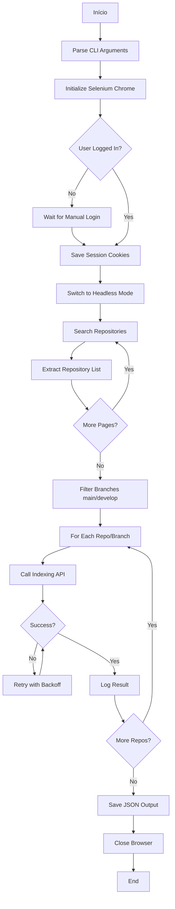

# Plano de Desenvolvimento - Aplicação de Indexação Devin

## Visão Geral
Aplicação Python para indexar repositórios do Devin usando web scraping com Selenium, permitindo login manual prévio e operação em modo headless após autenticação.

## Requisitos Funcionais

### 1. Entrada de Dados
- URL da API de indexing do Devin
- Termo de busca para filtrar repositórios
- Argumentos via linha de comando (`--url`, `--search-term`)

### 2. Autenticação
- Login manual realizado pelo usuário antes da execução
- Aplicação reutiliza a sessão do navegador já autenticada
- Suporte para modo headless após autenticação

### 3. Busca e Indexação
- Buscar repositórios usando o termo fornecido
- Filtrar apenas branches `main` e `develop`
- Indexar cada repositório/branch encontrado

### 4. Saída de Dados
- Arquivo JSON com resultados da indexação
- Logs detalhados no console
- Tratamento de erros e retry logic

## Arquitetura da Aplicação



## Estrutura de Diretórios

```
devin-index-repo-script/
├── src/
│   ├── __init__.py
│   ├── main.py                 # Entry point
│   ├── cli.py                  # CLI argument parser
│   ├── browser/
│   │   ├── __init__.py
│   │   ├── selenium_manager.py # Selenium setup and management
│   │   └── session_handler.py  # Cookie/session persistence
│   ├── scraper/
│   │   ├── __init__.py
│   │   ├── search.py           # Repository search logic
│   │   └── extractor.py        # Data extraction from pages
│   ├── indexer/
│   │   ├── __init__.py
│   │   ├── api_client.py       # API calls to Devin indexing
│   │   └── retry_handler.py    # Retry logic and rate limiting
│   └── utils/
│       ├── __init__.py
│       ├── logger.py           # Logging configuration
│       └── output.py           # JSON output writer
├── tests/
│   ├── __init__.py
│   ├── test_scraper.py
│   ├── test_indexer.py
│   └── test_integration.py
├── config/
│   └── config.example.json     # Example configuration
├── requirements.txt
├── README.md
├── .env.example
└── .gitignore
```

## Componentes Principais

### 1. CLI Module (`cli.py`)
```python
# Argumentos esperados:
--url              # URL da API de indexing
--search-term      # Termo para buscar repositórios
--headless         # Flag para modo headless (opcional)
--output           # Caminho do arquivo JSON de saída
--session-file     # Arquivo para salvar/carregar sessão
```

### 2. Selenium Manager (`browser/selenium_manager.py`)
- Inicialização do Chrome WebDriver
- Configuração de opções (headless, user-agent, etc.)
- Gerenciamento do ciclo de vida do navegador
- Detecção de login bem-sucedido

### 3. Session Handler (`browser/session_handler.py`)
- Salvar cookies após login manual
- Carregar cookies em execuções futuras
- Validar se sessão ainda está ativa
- Renovar sessão se necessário

### 4. Search Module (`scraper/search.py`)
- Navegar para página de busca
- Inserir termo de busca
- Implementar paginação
- Extrair lista de repositórios

### 5. Data Extractor (`scraper/extractor.py`)
- Extrair nome do repositório
- Extrair URL do repositório
- Identificar branches disponíveis
- Filtrar apenas main e develop

### 6. API Client (`indexer/api_client.py`)
- Fazer chamadas POST para API de indexing
- Enviar dados do repositório e branch
- Processar resposta da API
- Tratar erros HTTP

### 7. Retry Handler (`indexer/retry_handler.py`)
- Implementar exponential backoff
- Configurar número máximo de tentativas
- Rate limiting entre requisições
- Logging de tentativas

### 8. Output Module (`utils/output.py`)
- Estruturar dados em JSON
- Incluir metadados (timestamp, total, sucessos, falhas)
- Salvar arquivo com encoding UTF-8
- Validar estrutura do JSON

## Fluxo de Execução Detalhado

### Fase 1: Inicialização
1. Parse argumentos da linha de comando
2. Validar parâmetros obrigatórios
3. Configurar sistema de logging
4. Inicializar Selenium com Chrome

### Fase 2: Autenticação
1. Verificar se existe sessão salva
2. Se não existe:
   - Abrir navegador em modo visível
   - Navegar para página de login
   - Aguardar login manual do usuário
   - Detectar login bem-sucedido
   - Salvar cookies da sessão
3. Se existe:
   - Carregar cookies salvos
   - Validar se sessão ainda é válida

### Fase 3: Busca de Repositórios
1. Mudar para modo headless (se configurado)
2. Navegar para página de busca
3. Inserir termo de busca
4. Aguardar carregamento dos resultados
5. Extrair lista de repositórios da página atual
6. Verificar se há próxima página
7. Repetir até processar todas as páginas

### Fase 4: Processamento de Repositórios
1. Para cada repositório encontrado:
   - Acessar página do repositório
   - Identificar branches disponíveis
   - Filtrar apenas main e develop
   - Para cada branch válida:
     - Preparar payload para API
     - Chamar endpoint de indexing
     - Implementar retry se falhar
     - Registrar resultado (sucesso/falha)
     - Aplicar rate limiting

### Fase 5: Finalização
1. Compilar resultados em estrutura JSON
2. Salvar arquivo de saída
3. Exibir resumo no console
4. Fechar navegador
5. Limpar recursos

## Tratamento de Erros

### Erros de Rede
- Timeout em requisições
- Conexão perdida
- DNS não resolvido
- Retry automático com backoff

### Erros de Scraping
- Elemento não encontrado
- Estrutura da página mudou
- JavaScript não carregou
- Fallback para seletores alternativos

### Erros de API
- Rate limit excedido
- Autenticação expirada
- Payload inválido
- Retry com delay progressivo

### Erros de Sessão
- Cookies expirados
- Sessão invalidada
- Solicitar novo login manual

## Configuração e Dependências

### requirements.txt
```
selenium>=4.15.0
webdriver-manager>=4.0.1
requests>=2.31.0
python-dotenv>=1.0.0
click>=8.1.7
tenacity>=8.2.3
```

### Variáveis de Ambiente (.env)
```
DEVIN_INDEXING_URL=https://api.devin.ai/indexing
DEFAULT_SEARCH_TERM=
SESSION_FILE_PATH=./session.json
OUTPUT_FILE_PATH=./indexing_results.json
MAX_RETRIES=3
RETRY_DELAY=2
RATE_LIMIT_DELAY=1
HEADLESS_MODE=true
```

## Exemplo de Uso

```bash
# Primeira execução (com login manual)
python src/main.py --url "https://api.devin.ai/indexing" --search-term "machine-learning"

# Execuções subsequentes (usando sessão salva)
python src/main.py --url "https://api.devin.ai/indexing" --search-term "data-science" --headless

# Com arquivo de saída customizado
python src/main.py --url "https://api.devin.ai/indexing" --search-term "python" --output results.json
```

## Formato de Saída JSON

```json
{
  "metadata": {
    "timestamp": "2026-04-30T01:30:00Z",
    "search_term": "machine-learning",
    "total_repositories": 15,
    "total_branches_indexed": 28,
    "successful_indexations": 26,
    "failed_indexations": 2
  },
  "results": [
    {
      "repository": "org/ml-project",
      "url": "https://github.com/org/ml-project",
      "branch": "main",
      "status": "success",
      "indexed_at": "2026-04-30T01:31:15Z",
      "api_response": {
        "message": "Repository indexed successfully"
      }
    },
    {
      "repository": "org/ml-project",
      "url": "https://github.com/org/ml-project",
      "branch": "develop",
      "status": "success",
      "indexed_at": "2026-04-30T01:31:18Z",
      "api_response": {
        "message": "Repository indexed successfully"
      }
    }
  ],
  "errors": [
    {
      "repository": "org/failed-repo",
      "branch": "main",
      "error": "Rate limit exceeded",
      "attempts": 3,
      "last_attempt": "2026-04-30T01:35:00Z"
    }
  ]
}
```

## Considerações de Segurança

1. **Credenciais**: Nunca armazenar senhas em código ou logs
2. **Cookies**: Armazenar em arquivo com permissões restritas
3. **API Keys**: Usar variáveis de ambiente
4. **Logs**: Não registrar dados sensíveis
5. **HTTPS**: Sempre usar conexões seguras

## Melhorias Futuras

1. Suporte para múltiplos navegadores (Firefox, Edge)
2. Interface gráfica para configuração
3. Modo batch para processar múltiplos termos de busca
4. Dashboard web para visualizar resultados
5. Integração com CI/CD para indexação automática
6. Suporte para webhooks de notificação
7. Cache de resultados para evitar reprocessamento
8. Métricas e analytics de performance

## Testes

### Testes Unitários
- Validação de argumentos CLI
- Parsing de dados extraídos
- Lógica de retry
- Formatação de JSON

### Testes de Integração
- Fluxo completo de scraping
- Chamadas à API de indexing
- Persistência de sessão

### Testes End-to-End
- Execução completa com dados reais
- Validação de output final