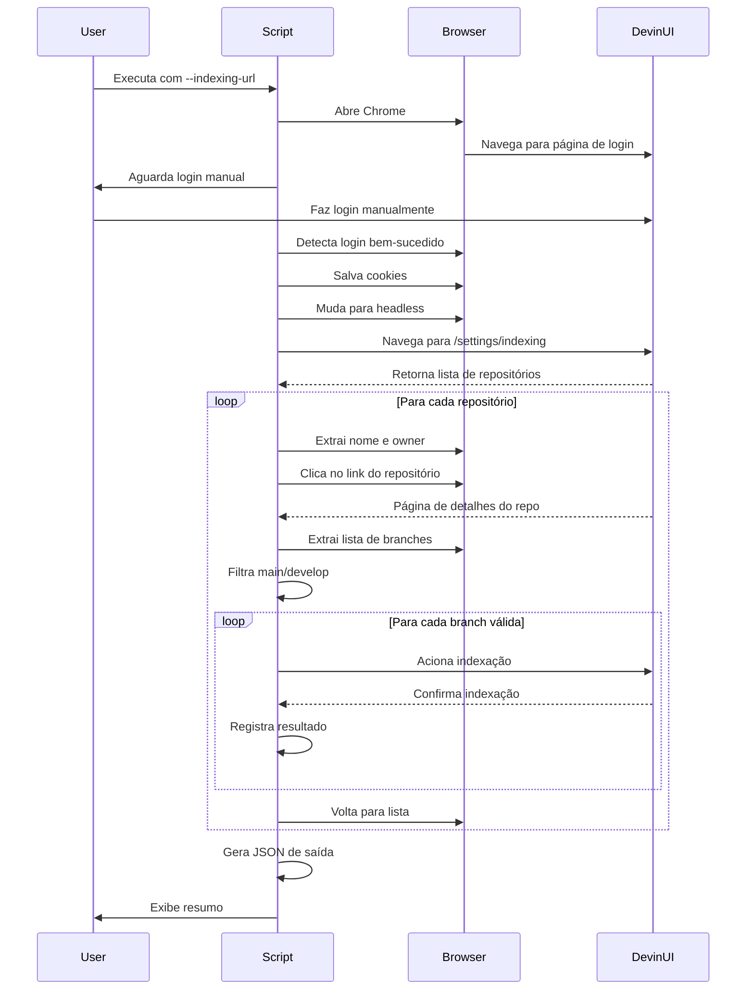

# Especificação Técnica - Devin Repository Indexer

## Análise da Interface do Devin

### Estrutura da Página de Indexing

Baseado no HTML fornecido, a página de indexing do Devin (`/org/{org}/settings/indexing`) possui:

#### 1. Elementos Principais

**Barra de Busca:**
```html
<input placeholder="Search repositories..." 
       class="...flex w-full min-w-0..." 
       data-slot="input-group-control">
```

**Botão de Refresh:**
```html
<button aria-label="Refresh repositories" 
        class="...bg-transparent text-text-secondary...">
  <svg><!-- Ícone de refresh --></svg>
</button>
```

**Lista de Repositórios:**
```html
<div class="border-border-secondary overflow-hidden rounded-[10px] border p-[6px]">
  <a href="/org/rafaelakio/settings/indexing/repositories/{owner}/{repo}">
    <div class="text-text-primary text-13 truncate">{repo-name}</div>
    <div class="text-text-secondary text-13 truncate">{owner}</div>
    <span class="text-text-secondary text-13">
      <svg><!-- Check icon --></svg>
      {n} branch(es) indexed
    </span>
  </a>
</div>
```

#### 2. Seletores CSS Identificados

| Elemento | Seletor CSS | Descrição |
|----------|-------------|-----------|
| Campo de busca | `input[placeholder="Search repositories..."]` | Input para filtrar repositórios |
| Botão refresh | `button[aria-label="Refresh repositories"]` | Atualiza lista de repos |
| Card de repositório | `a[href*="/settings/indexing/repositories/"]` | Link para detalhes do repo |
| Nome do repositório | `.text-text-primary.text-13.truncate` | Nome do repositório |
| Owner do repositório | `.text-text-secondary.text-13.truncate` | Dono do repositório |
| Status de indexação | `span.text-text-secondary.text-13` | Quantidade de branches indexadas |

#### 3. Padrão de URLs

```
Base: https://devin.ai
Login: /org/{org}/settings/indexing
Repositório: /org/{org}/settings/indexing/repositories/{owner}/{repo}
```

### Fluxo de Navegação Detalhado



## Estratégia de Implementação

### Fase 1: Autenticação e Navegação

```python
# Pseudocódigo
def authenticate():
    driver.get(indexing_url)
    
    # Detectar se já está logado
    if not is_logged_in():
        print("Por favor, faça login manualmente...")
        wait_for_login_completion()
        save_session_cookies()
    else:
        load_session_cookies()
    
    # Validar que está na página correta
    assert "/settings/indexing" in driver.current_url
```

### Fase 2: Extração de Repositórios

```python
def extract_repositories():
    # Aguardar carregamento da lista
    wait_for_element("a[href*='/settings/indexing/repositories/']")
    
    # Extrair todos os cards de repositório
    repo_cards = driver.find_elements(
        By.CSS_SELECTOR, 
        "a[href*='/settings/indexing/repositories/']"
    )
    
    repositories = []
    for card in repo_cards:
        repo_name = card.find_element(
            By.CSS_SELECTOR, 
            ".text-text-primary.text-13.truncate"
        ).text
        
        owner = card.find_element(
            By.CSS_SELECTOR, 
            ".text-text-secondary.text-13.truncate"
        ).text
        
        repo_url = card.get_attribute("href")
        
        repositories.append({
            "name": repo_name,
            "owner": owner,
            "url": repo_url
        })
    
    return repositories
```

### Fase 3: Busca e Filtragem

```python
def search_repositories(search_term):
    # Localizar campo de busca
    search_input = driver.find_element(
        By.CSS_SELECTOR,
        "input[placeholder='Search repositories...']"
    )
    
    # Limpar e inserir termo
    search_input.clear()
    search_input.send_keys(search_term)
    
    # Aguardar atualização da lista
    time.sleep(2)
    
    # Extrair repositórios filtrados
    return extract_repositories()
```

### Fase 4: Detalhes do Repositório

```python
def get_repository_branches(repo_url):
    driver.get(repo_url)
    
    # Aguardar carregamento da página de detalhes
    wait_for_page_load()
    
    # Extrair informações de branches
    # (estrutura específica precisa ser analisada na página de detalhes)
    branches = extract_branch_information()
    
    # Filtrar apenas main e develop
    valid_branches = [
        b for b in branches 
        if b["name"].lower() in ["main", "develop"]
    ]
    
    return valid_branches
```

### Fase 5: Indexação

```python
def index_branch(repo_name, branch_name):
    try:
        # Localizar botão/checkbox de indexação para a branch
        # (implementação depende da UI específica)
        index_button = find_index_control(branch_name)
        
        if not is_already_indexed(branch_name):
            index_button.click()
            wait_for_indexing_confirmation()
            
            return {
                "status": "success",
                "repository": repo_name,
                "branch": branch_name,
                "timestamp": datetime.now().isoformat()
            }
        else:
            return {
                "status": "already_indexed",
                "repository": repo_name,
                "branch": branch_name
            }
            
    except Exception as e:
        return {
            "status": "error",
            "repository": repo_name,
            "branch": branch_name,
            "error": str(e)
        }
```

## Estrutura de Dados

### Configuração de Entrada

```python
@dataclass
class Config:
    indexing_url: str  # URL da página de indexing
    search_term: str   # Termo para filtrar repositórios
    output_file: str   # Caminho do arquivo JSON de saída
    session_file: str  # Arquivo para salvar sessão
    headless: bool     # Modo headless após login
    max_retries: int   # Tentativas máximas por operação
    rate_limit: float  # Delay entre operações (segundos)
```

### Estrutura de Saída JSON

```json
{
  "metadata": {
    "execution_timestamp": "2026-04-30T01:30:00Z",
    "indexing_url": "https://devin.ai/org/rafaelakio/settings/indexing",
    "search_term": "poc",
    "total_repositories_found": 15,
    "total_repositories_processed": 15,
    "total_branches_indexed": 28,
    "successful_indexations": 26,
    "failed_indexations": 2,
    "already_indexed": 5,
    "execution_time_seconds": 245.3
  },
  "repositories": [
    {
      "name": "poc-glue-data-pipeline",
      "owner": "rafaelakio",
      "url": "https://devin.ai/org/rafaelakio/settings/indexing/repositories/rafaelakio/poc-glue-data-pipeline",
      "branches_found": ["main", "develop", "feature-x"],
      "branches_processed": ["main", "develop"],
      "results": [
        {
          "branch": "main",
          "status": "success",
          "indexed_at": "2026-04-30T01:31:15Z",
          "message": "Branch indexed successfully"
        },
        {
          "branch": "develop",
          "status": "success",
          "indexed_at": "2026-04-30T01:31:18Z",
          "message": "Branch indexed successfully"
        }
      ]
    }
  ],
  "errors": [
    {
      "repository": "failed-repo",
      "branch": "main",
      "error_type": "timeout",
      "error_message": "Timeout waiting for indexing confirmation",
      "attempts": 3,
      "last_attempt": "2026-04-30T01:35:00Z"
    }
  ],
  "skipped": [
    {
      "repository": "already-indexed-repo",
      "branch": "main",
      "reason": "Already indexed",
      "checked_at": "2026-04-30T01:32:00Z"
    }
  ]
}
```

## Tratamento de Casos Especiais

### 1. Repositórios Sem Branches Válidas

```python
if not valid_branches:
    logger.warning(f"No valid branches (main/develop) found for {repo_name}")
    skipped_repos.append({
        "repository": repo_name,
        "reason": "No valid branches found",
        "branches_available": all_branches
    })
    continue
```

### 2. Repositórios Já Indexados

```python
if is_already_indexed(repo_name, branch_name):
    logger.info(f"{repo_name}:{branch_name} already indexed, skipping")
    already_indexed.append({
        "repository": repo_name,
        "branch": branch_name,
        "status": "already_indexed"
    })
    continue
```

### 3. Erros de Rede ou Timeout

```python
@retry(
    stop=stop_after_attempt(3),
    wait=wait_exponential(multiplier=1, min=2, max=10),
    retry=retry_if_exception_type(TimeoutException)
)
def index_with_retry(repo, branch):
    return index_branch(repo, branch)
```

### 4. Mudanças na Estrutura da Página

```python
def safe_find_element(selector, timeout=10):
    try:
        element = WebDriverWait(driver, timeout).until(
            EC.presence_of_element_located((By.CSS_SELECTOR, selector))
        )
        return element
    except TimeoutException:
        logger.error(f"Element not found: {selector}")
        logger.info("Page structure may have changed")
        take_screenshot("error_page_structure.png")
        raise PageStructureChangedError(selector)
```

## Otimizações de Performance

### 1. Caching de Repositórios

```python
# Cache para evitar reprocessamento
repo_cache = {}

def get_cached_repo_info(repo_url):
    if repo_url in repo_cache:
        logger.debug(f"Using cached info for {repo_url}")
        return repo_cache[repo_url]
    
    info = fetch_repo_info(repo_url)
    repo_cache[repo_url] = info
    return info
```

### 2. Processamento Paralelo (Opcional)

```python
from concurrent.futures import ThreadPoolExecutor

def index_repositories_parallel(repositories, max_workers=3):
    with ThreadPoolExecutor(max_workers=max_workers) as executor:
        futures = []
        for repo in repositories:
            future = executor.submit(process_repository, repo)
            futures.append(future)
        
        results = [f.result() for f in futures]
    
    return results
```

### 3. Rate Limiting Inteligente

```python
class AdaptiveRateLimiter:
    def __init__(self, initial_delay=1.0):
        self.delay = initial_delay
        self.last_request = 0
        
    def wait(self):
        elapsed = time.time() - self.last_request
        if elapsed < self.delay:
            time.sleep(self.delay - elapsed)
        self.last_request = time.time()
    
    def increase_delay(self):
        """Aumenta delay se detectar rate limiting"""
        self.delay = min(self.delay * 1.5, 10.0)
        logger.warning(f"Rate limit detected, increasing delay to {self.delay}s")
    
    def decrease_delay(self):
        """Diminui delay se operações estão fluindo bem"""
        self.delay = max(self.delay * 0.9, 0.5)
```

## Logging e Monitoramento

### Estrutura de Logs

```python
# Configuração de logging
logging.config.dictConfig({
    'version': 1,
    'formatters': {
        'detailed': {
            'format': '%(asctime)s - %(name)s - %(levelname)s - %(message)s'
        },
        'simple': {
            'format': '%(levelname)s - %(message)s'
        }
    },
    'handlers': {
        'console': {
            'class': 'logging.StreamHandler',
            'level': 'INFO',
            'formatter': 'simple'
        },
        'file': {
            'class': 'logging.FileHandler',
            'filename': 'indexer.log',
            'level': 'DEBUG',
            'formatter': 'detailed'
        }
    },
    'root': {
        'level': 'DEBUG',
        'handlers': ['console', 'file']
    }
})
```

### Métricas de Execução

```python
class ExecutionMetrics:
    def __init__(self):
        self.start_time = time.time()
        self.repos_processed = 0
        self.branches_indexed = 0
        self.errors = 0
        self.retries = 0
    
    def record_success(self):
        self.branches_indexed += 1
    
    def record_error(self):
        self.errors += 1
    
    def record_retry(self):
        self.retries += 1
    
    def get_summary(self):
        elapsed = time.time() - self.start_time
        return {
            "execution_time_seconds": elapsed,
            "repos_processed": self.repos_processed,
            "branches_indexed": self.branches_indexed,
            "errors": self.errors,
            "retries": self.retries,
            "avg_time_per_repo": elapsed / max(self.repos_processed, 1)
        }
```

## Exemplo de Uso

```bash
# Primeira execução (com login manual)
python src/main.py \
  --indexing-url "https://devin.ai/org/rafaelakio/settings/indexing" \
  --search-term "poc" \
  --output results.json

# Execuções subsequentes (usando sessão salva)
python src/main.py \
  --indexing-url "https://devin.ai/org/rafaelakio/settings/indexing" \
  --search-term "data" \
  --output data-repos.json \
  --headless

# Com configurações customizadas
python src/main.py \
  --indexing-url "https://devin.ai/org/rafaelakio/settings/indexing" \
  --search-term "api" \
  --output api-repos.json \
  --max-retries 5 \
  --rate-limit 2.0 \
  --verbose
```

## Próximos Passos

1. ✅ Análise da estrutura HTML do Devin
2. ✅ Definição de seletores CSS
3. ✅ Especificação do fluxo de dados
4. ⏳ Implementação dos módulos principais
5. ⏳ Testes com dados reais
6. ⏳ Documentação de uso
7. ⏳ Tratamento de edge cases

## Referências

- [`PLAN.md`](PLAN.md) - Plano geral do projeto
- [`ARCHITECTURE.md`](ARCHITECTURE.md) - Arquitetura detalhada
- [`IMPLEMENTATION_GUIDE.md`](IMPLEMENTATION_GUIDE.md) - Guia de implementação